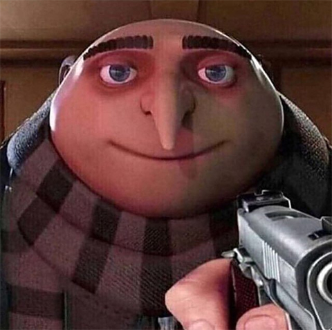

<html>
<html>	
	<head>
		<link rel="stylesheet" type="text/css" href="mystyle.css">
			<title>Nisse's site</title>
	</head>
		<body>
		<ul>
			<li><a href="index.html">Home</a></li>
			<li><a href="content.html">Content</a></li>
			<li><a class="active" href="meme.html">Meme</a></li>
			<li><a href="video.html">Video</a></li>
			<li><a href="stories.html">Stories</a></li>
			</ul>
			
			
	</body>
</html>
